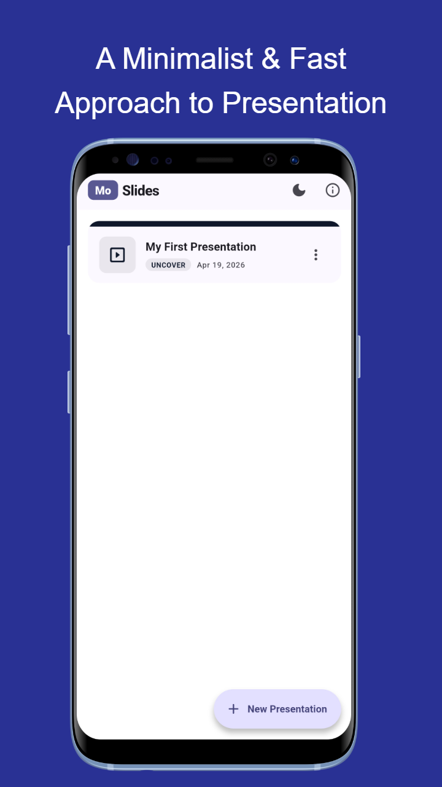
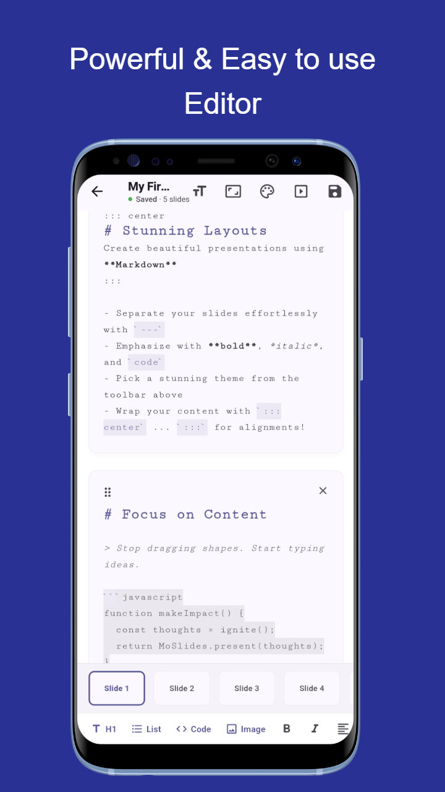
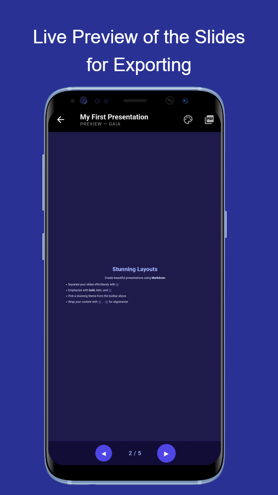
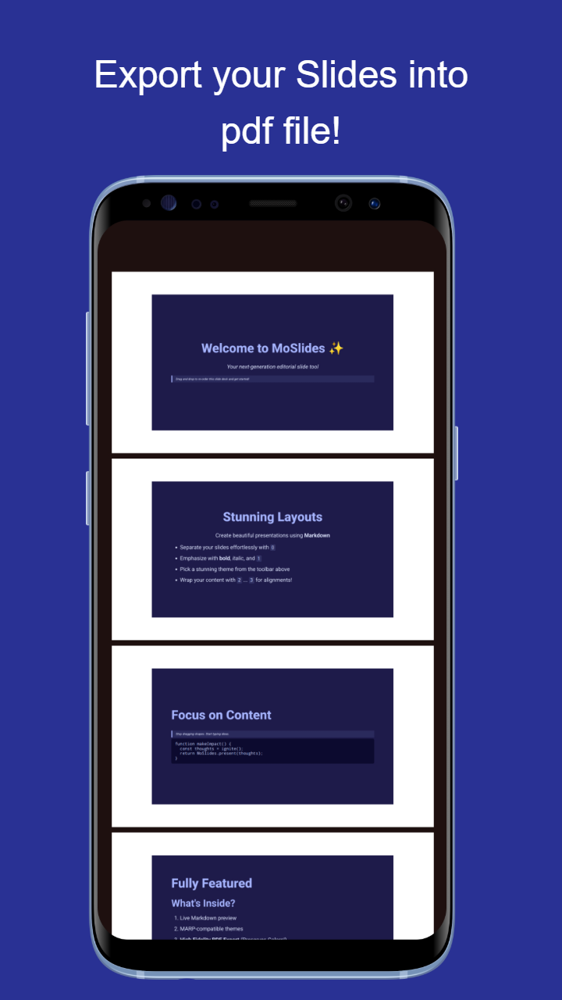
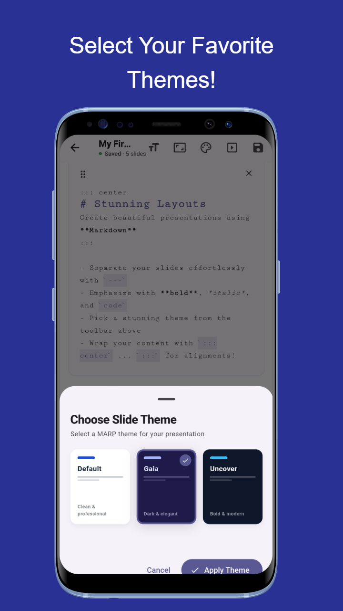

# MoSlides ✨

**Beautiful Markdown Presentations Made Easy.**

[](https://github.com/nugehoodg/MoSlides/releases)

MoSlides is a powerful, lightweight Flutter application that allows you to create professional-quality presentations using the simple and intuitive Markdown syntax. Powered by the **MARP (Markdown Presentation Ecosystem)**, MoSlides bridges the gap between structured writing and stunning visual storytelling.

---

## 🚀 Key Features

- **Live Markdown Preview**: See your changes in real-time as you type. Your ideas take shape instantly.
- **MARP Integration**: Full support for MARP-compatible themes and directives.
- **Dynamic Themes**: Choose from beautiful, pre-configured themes like `Gaia`, `Uncover`, and `Default`.
- **High-Fidelity PDF Export**: Export your presentations to high-quality PDF files while preserving all colors, layouts, and styles.
- **Drag & Drop Reordering**: Easily manage your slide deck by dragging slides into the perfect order.
- **Smart Alignment**: Use custom containers (e.g., `::: center`) to perfectly align your content.
- **Mobile & Web Ready**: Built with Flutter for a seamless experience across platforms.
- **Customizable Layouts**: Adjust font sizes and slide dimensions (e.g., 16:9, 4:3) on the fly.

---

## 📸 Screenshots

Take a look at MoSlides in action:

| Home Screen | Slide Editor | Live Preview |
| :---: | :---: | :---: |
|  |  |  |

| PDF Export | Theme Selection |
| :---: | :---: |
|  |  |

---

## 🛠️ Technology Stack

- **Framework**: [Flutter](https://flutter.dev/) (3.0+)
- **Presentation Engine**: [MARP](https://marp.app/)
- **State Management**: [Provider](https://pub.dev/packages/provider)
- **PDF Engine**: [Printing](https://pub.dev/packages/printing) & [pdf](https://pub.dev/packages/pdf)
- **WebView**: [webview_flutter](https://pub.dev/packages/webview_flutter)
- **Icons**: [Cupertino Icons](https://pub.dev/packages/cupertino_icons)

---

## ⚙️ Getting Started

### Prerequisites

- Flutter SDK Installed ([Installation Guide](https://docs.flutter.dev/get-started/install))
- A mobile device or emulator

### Installation

1. **Clone the repository:**
   ```bash
   git clone https://github.com/nugehoodg/moslides.git
   cd moslides
   ```

2. **Install dependencies:**
   ```bash
   flutter pub get
   ```

3. **Run the app:**
   ```bash
   flutter run
   ```

---

## 📖 Usage

1. **Create**: Open the app and start a new presentation.
2. **Write**: Use Markdown to write your content. Use `---` to separate slides.
3. **Style**: Use the toolbar to change themes, font sizes, or alignments.
4. **Export**: Click the Export icon to generate a PDF of your presentation.

---

## 📄 License

This project is licensed under the MIT License - see the [LICENSE](LICENSE) file for details.

---

## 🙌 Contributing

Contributions are welcome! If you have a feature request or found a bug, please open an issue or submit a pull request.

---

<p align="center">Made with ❤️ for presenters everywhere.</p>
